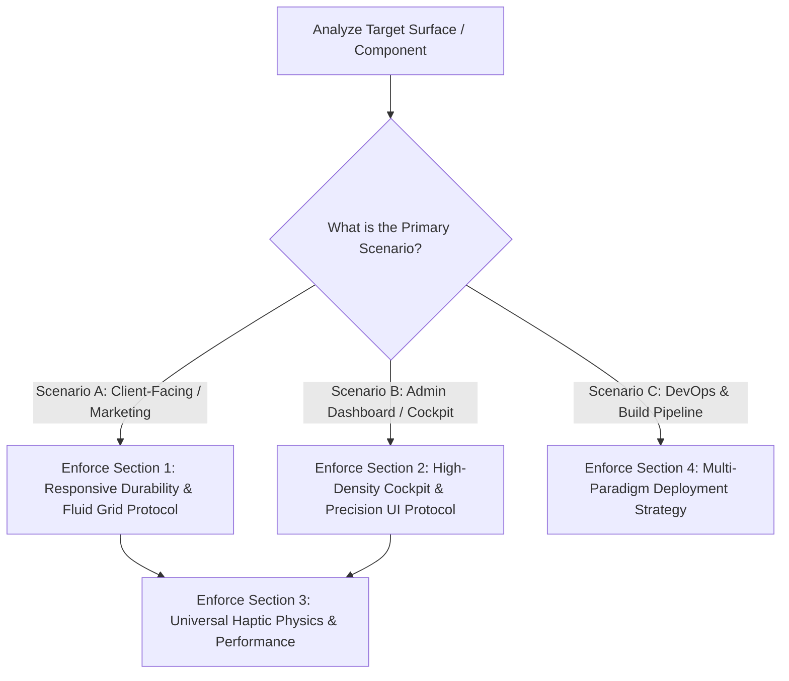

# Premium Frontend Web Development Standards 🚀✨
**Author**: Sifat  
**Origin**: While developing high-end frontend projects with AI agents, I observed recurring layout, structural, and scaling issues across both generic AI-generated code and specialized UI interfaces. To solve this, I created this "AI Skill"—a comprehensive set of conditional rules and battle-tested engineering protocols designed to guide AI agents toward producing durable, high-performance, and visually impeccable frontend code across every project paradigm.  
**Purpose**: A Universal, Scenario-Aware AI Skill File for high-end web development, responsive durability, cockpit-dense dashboards, and automated DevOps.

> [!IMPORTANT]
> **Tablet & Device Testing Disclaimer**: While these protocols have been battle-tested on multiple mobile, desktop, and edge environments, always validate multi-column orientation shifts on actual hardware when deploying critical client surfaces. If you discover edge-case behavior during production QA, your feedback and suggested updates are highly encouraged!

---

## **When and Where to Use This Skill** 🎯

This skill should be activated and utilized automatically across all frontend development tasks. However, to prevent applying the wrong architectural rules to the wrong surfaces, AI coding assistants MUST first classify the target scenario using our **Conditional Execution Engine**.

### 1. **Target Project Archetypes (Where to Use)**
* **Scenario A: Marketing Websites, Landing Pages & SaaS Shells:** Fluid, high-conversion layouts (`/`, promotional pages, creative portfolios) where responsive wrapping, visual elasticity, and scroll-reveal aesthetics rule.
* **Scenario B: High-Density Instrumentation Cockpits (`/admin`, CRMs, Command Decks):** Dense, precision-machined dashboards where data visibility, rigid sidebar boundaries (`220px`), exact internal padding (`!important`), and sub-pixel alignment take absolute priority over standard responsive wrapping.
* **Scenario C: Production Deployment & CI/CD Pipelines:** Automated build and deployment tasks across modern edge/serverless runtimes (`Cloudflare, Vercel, Next.js`) and traditional server architectures (`cPanel, PHP, Apache`).

---

## **The Conditional Execution Engine (AI Scenario Routing)** 🧭

Before writing code or adjusting layouts, **AI agents must identify which scenario applies to the target file/component and enforce only the matching conditional protocol**:



---

## **How to Use** 🛠️

### 1. **For AI Coding Assistants (Automatic)**
Once installed in `.agents/skills/`, this skill activates whenever the assistant is asked to build pages, refactor layouts, style UI components, write animation logic, or configure deployment workflows.
* **Proactive Prompt Triggering:**
  > *"Refactor our dashboard layout following the `premium-frontend-standards` Scenario B (Cockpit) guidelines."*
  > *"Build the responsive landing page using our `premium-frontend-standards` Scenario A (Marketing) protocol."*

### 2. **Installation & Reusability**
Install the skill into any project using the Agent Skills CLI:
```bash
npx skills add https://github.com/Sifat-SS/frontend-layout-standard-ai-skills.git
```

---

## 1. **Scenario A: Responsive Durability Protocol (`Marketing & Client Shells`)** 📱
*Apply these rules when building client-facing websites, hero sections, multi-item feature stacks, and interactive galleries where content fluidity and mobile readability are paramount.*

- **Rule 1.1: The "No-Cage" Rule (`height: auto` vs. Fixed Heights)**  
  Never set fixed `height` values within media queries for primary containers (`hero` cards, feature blocks, accordion panels, or timeline stacks). Always use `height: auto` or `min-height` to allow containers to scale naturally as text wraps across smaller mobile viewports (`390px / 430px`). Trapping content inside fixed heights causes text clipping, overlapping containers, and broken mobile UX.

- **Rule 1.2: In-App WebView Browser Overrides**  
  When building grid-based landing pages or promotional modals targeting mobile traffic, use `width: 100% !important` and `height: 100% !important` on primary grid shells to override restrictive viewport defaults inside mobile social media WebViews (`Instagram, Facebook, TikTok in-app browsers`).

- **Rule 1.3: Asset & Aspect-Ratio Scaling**  
  - **Interactive Galleries & Cards:** Use `object-fit: cover` with explicit aspect ratios (`aspect-video` or `aspect-[4/3]`) to maintain clean grid symmetry across varying screen sizes.
  - **Promotional Banners & Text Images:** Use `object-fit: contain` paired with `height: auto` to guarantee that embedded text or diagrams are never cropped out.

- **Rule 1.4: Premium Multi-Column Breakpoints (`No Premature Stacking`)**  
  On tablet viewports (`1024px / 768px`), adjust grid column ratios (`1.5fr 1fr 1fr`) to preserve a side-by-side editorial feel rather than dropping prematurely to a single vertical column. Only drop to a single column below `640px` (mobile).

---

## 2. **Scenario B: High-Density Cockpit & Admin Protocol (`Command Decks`)** 🖥️
*Apply these rules when building internal CRMs, admin consoles (`app/admin/`), instrumentation cockpits, data grids, and control panels where precision geometry, exact spacing, and zero layout thrashing are mandatory.*

- **Rule 2.1: The Single-View Cockpit Rule (`No Full-Page Stacking`)**  
  In a dense admin dashboard, standard responsive wrapping (`auto-fit`) must **not** be allowed to push the primary navigation sidebar above or below the main canvas on desktop viewports (`>= 1024px`).  
  - Enforce a rigid, non-scrolling vertical navigation shell (`w-[220px] shrink-0 h-full select-none`) paired with a scrollable right-side workspace container (`flex-1 min-w-0 overflow-y-auto overflow-x-hidden`).
  - Below `768px` (mobile/tablet), convert the sidebar into a high-precision slide-over drawer (`SlideOverDrawer`) or bottom navigation bar (`min-h-[54px]`) with generous touch targets.

- **Rule 2.2: True Equal Post-Sidebar Padding (`120px Equal Cushioning`)**  
  When a fixed vertical sidebar (`220px`) sits on the left side of a widescreen browser (`1440p / 1080p`), applying global padding (`px-12`) across the entire screen causes severe visual asymmetry (the card collides against the sidebar while leaving massive empty space on the far right).  
  - **Mandatory Fix:** Always measure and apply horizontal padding (`paddingLeft: clamp(32px, 6vw, 120px), paddingRight: clamp(32px, 6vw, 120px)`) strictly **inside** the right-side `flex-1` workspace container. This guarantees that the distance from the right edge of the sidebar to the card equals the exact distance from the card to the right edge of the browser window (`100% equal visual symmetry`).

- **Rule 2.3: Global CSS Reset Insulation & Bulletproof Surface Padding (`!important`)**  
  Global CSS resets (`form, div { padding: 0; }` or fluid hero `h1/h2` clamps in `base.css`) will strip utility padding (`p-8`, `pt-6`) and distort headings inside modular hardware enclosures.  
  - **Insulation:** Convert semantic headings (`h1, h2, p`) inside dense tool panels to neutral `div` elements with explicit font styling (`text-2xl font-bold`) to prevent global stylesheet contamination.
  - **Bulletproof Padding:** Always inject dedicated `!important` surface classes directly into the admin layout (`app/admin/page.tsx` style block) to make padding unbreakable:
    ```css
    .admin-surface-card {
      padding: clamp(28px, 4vw, 40px) clamp(28px, 4vw, 56px) !important;
      box-sizing: border-box !important;
      width: 100% !important;
    }
    .admin-form-surface {
      padding: 24px clamp(28px, 4vw, 56px) 20px clamp(28px, 4vw, 56px) !important;
      box-sizing: border-box !important;
      width: 100% !important;
    }
    ```
  - **Inner Form Padding Cushion:** Push internal form headings (`PUBLIC STATUS HEADLINE`) and input boxes (`Available for work`) well inwards away from outer card boundaries using exact inner padding (`paddingLeft: 28px, paddingRight: 28px`). This keeps top corners clean without altering total card dimensions (`keep card same size`).

- **Rule 2.4: Machined Outer vs. Inner Corner Geometry (`rounded-2xl` Harmony)**  
  Never use bulbous, oversized landing-page curves (`36px` / `rounded-[2.25rem]`) on dense admin enclosures. All outer Command Deck cards (`Availability Engine`, `Projects`, `Blog Articles`, and empty state cards) must strictly enforce **`rounded-2xl`** (`16px border-radius`). This exact 16px radius creates geometric harmony that matches inner text inputs and switch containers (`rounded-2xl`).

- **Rule 2.5: Sub-Pixel Form & Button Alignment (`box-sizing: border-box`)**  
  For single-card login surfaces or status forms (`420px width`), avoid nested `max-w-[...]` clamping inside `<form>` elements when the outer card already defines max-width.  
  - Enforce `box-sizing: border-box` and explicit `width: 100%` inline across both input controls and action buttons (`54px height`), paired with explicit card padding (`48px`). This locks identical sub-pixel alignment so form controls match edge-to-edge without horizontal overflow or one-sided edge gaps.

- **Rule 2.6: Sleek Action Proportions & Divider Separation**  
  - Standardize primary and action buttons across all dashboard tabs (`ProjectsTab`, `PostsTab`, `MediaTab`, `SlideOverDrawer`) to sleek, compact dimensions (`paddingTop: 9px, paddingBottom: 9px, paddingLeft: 20px–22px, paddingRight: 20px–22px`). Avoid oversized `py-4 px-10` buttons inside dense panels.
  - **Divider Separation:** When placing action buttons (`Save Availability`) below horizontal dividing lines (`border-t border-white/10`), apply explicit inline spacing (`style={{ paddingTop: "14px", marginTop: "16px", borderTop: "1px solid rgba(255, 255, 255, 0.12)" }}`) so buttons sit balanced with crystal-clear separation and zero chance of touching the dividing line.
  - **Empty State Deduplication:** Always wrap header row create buttons (`+ New Article`, `+ New Project`) with conditional visibility (`posts.length > 0 && (...)`) so that when a list is empty (`posts.length === 0`), only the centered empty state CTA is rendered.

- **Rule 2.7: Drag-and-Drop Handler Verification (`Media Picker & Storage`)**  
  Before binding drag-and-drop JSX attributes (`onDragOver`, `onDragLeave`, `onDrop`) to media uploaders or R2 storage buckets (`MediaTab.tsx`), always verify that local state (`const [dragActive, setDragActive] = useState(false)`) and complete event handler functions (`handleDragOver`, `handleDragLeave`, `handleDrop`) are explicitly defined right inside the component to prevent fatal runtime `ReferenceError: handleDragOver is not defined` crashes.

---

## 3. **Universal Performance, Haptic Physics & Motion Protocol** ⚡
*Apply these rules across ALL scenarios (`Scenario A` and `Scenario B`) to guarantee agency-grade tactile feedback and rock-solid GPU rendering.*

- **Rule 3.1: Emil Kowalski Tactile Haptic Physics (`transform: scale(0.97)`)**  
  Every interactive element (`buttons, clickable cards, toggle switches, tab switchers`) must implement snappy hardware-accelerated scale reductions on press (`transform: scale(0.97)` via `active:scale-95` or `active:scale-97`). This provides instant physical weight and tactile feedback without layout thrashing.
  - **Custom Easings:**
    * `--ease-out`: `cubic-bezier(0.23, 1, 0.32, 1)` (snappy UI button/modal feedback)
    * `--ease-drawer`: `cubic-bezier(0.32, 0.72, 0, 1)` (natural iOS slide-over physics)

- **Rule 3.2: Hardware Acceleration & GPU Layering (`will-change`)**  
  Restrict animations strictly to GPU-friendly properties (`transform` and `opacity`). Never animate `height`, `width`, `margin`, or `padding` on high-frequency triggers. Force GPU layering (`will-change: transform, opacity`) on critical animated containers to ensure 60fps rendering across low-power mobile devices.

- **Rule 3.3: Granular Scroll Reveals & Stacking Context Isolation**  
  - **Granular Stagger Triggers:** Decouple giant container wrappers (`.stack-shell`, `.contact-wrap`) into item-level stagger triggers using `IntersectionObserver`. Set `rootMargin: -25%` (requiring elements to enter the middle reading zone before triggering) and use calibrated timing (`0.95s` duration, `160ms` stagger) so items never animate invisibly while scrolling slowly.
  - **CSS Blending & Stacking Contexts:** If applying `mix-blend-mode: difference` over split background colors (`white/black`), move the blend property to the parent layer that generates the `z-index` / `position: absolute` stacking context (`.splash-static-rings`). Furthermore, **never combine `mix-blend-mode: difference` and `backdrop-filter: blur` on the same DOM element**, as browser rendering engines (`Chrome/Safari`) will abandon the blend mode and fall back to `normal` rendering.

- **Rule 3.4: Unicode & Numeric Entity Escaping (`No Raw &nearr;`)**  
  Never write raw HTML named entity references (`&nearr;`, `&rarr;`) directly inside React/Next.js JSX strings, as React does not decode non-XML entities and will render `&nearr;` literally as text. Always use direct Unicode symbols (`↗`, `−`, `©`) or numeric character references (`&#8599;`), or cleanly eliminate decorative arrows for a sleeker minimalist presentation.

- **Rule 3.5: Character Washout Protection Over Diagonal Splits**  
  When text spans across a high-contrast diagonal background split (`clip-path` transition from white to black), wrap key boundary characters individually in `<span>` tags (`.splash-letter-i`, `.splash-letter-t`). Assign exact local gradients (`#1C1C1E 0%, #28282B 35%, #E5E5E7 100%`) so boundary characters maintain dark tones over the white panel while immediately popping to `#E5E5E7` across the black panel.

---

## 4. **Scenario C: Multi-Paradigm Deployment & DevOps Strategy** 🛰️
*Before applying deployment configs or cache busters, AI agents must detect the underlying infrastructure architecture:*

### 4.1 **Paradigm 1: Modern Edge / Serverless Stack (`Next.js App Router, Cloudflare Workers/Pages, Vercel, Netlify`)**
- **Immutable Content-Addressed Caching:** Modern framework bundlers (`Next.js SWC / webpack`) automatically generate immutable, content-hashed chunk filenames (`chunks/416-53d9ffb2691dbb80.js`). **Do not** inject manual query-string cache busters (`?v=2.0`) into JS/CSS imports or module headers, as this interferes with automated edge CDN caching.
- **Mandatory Pre-Flight Build Verification:** Before making success claims or merging branches, always run automated verification commands:
  ```bash
  npm run build
  npx tsc --noEmit
  ```
  Ensure zero TypeScript boundary errors, zero Server/Client hydration mismatches, and complete static/dynamic route generation.

### 4.2 **Paradigm 2: Traditional Server / cPanel / PHP Stack (`Static HTML/CSS, Apache/LiteSpeed, Custom PHP`)**
- **Explicit Query-String Cache Busting:** When deploying static HTML/CSS or custom PHP architectures via traditional hosting (`cPanel`), aggressive browser/CDN caching will lock old styles. Always append explicit version query strings to asset links:
  ```html
  <link rel="stylesheet" href="css/base.css?v=2.4">
  <script src="js/main.js?v=1.8"></script>
  ```
- **The Handshake & Absolute Path Protocol:** Store all deployment pull scripts (`git pull origin master 2>&1`), `.cpanel.yml` configs, and sensitive API tokens safely outside the public web root (`public_html`). Always use absolute server file paths inside `.cpanel.yml` file movement tasks to guarantee atomic deployment across environment lines.
- **Security & Modal Cleanliness:** Never commit hardcoded production login credentials or hint text (`Hint: admin / root`) inside client-facing authentication surfaces before pushing to GitHub repositories.

---

## 5. **Scenario D: Situational Bilingual "Zero-Reload" Strategy (`Conditional Option`)** 🌍
*Only activate this protocol if a project explicitly specifies multi-language toggle functionality without page reloads. Do not apply to single-language builds.*
- **Method:** Render both language strings directly within the DOM markup. Use a `data-lang` attribute on the root `<html>` tag and toggle visibility cleanly via CSS (`html[data-lang="en"] .lang-bn { display: none; }`).
- **Persistence:** Save the selected language preference to `localStorage` immediately upon toggle (`localStorage.setItem('app_lang', 'bn')`) and re-hydrate it synchronously before first paint to prevent layout flicker (`FOUC`).

---
**Standard Updated**: July 2026  
**Status**: Universal / Scenario-Aware / Battle-Tested
